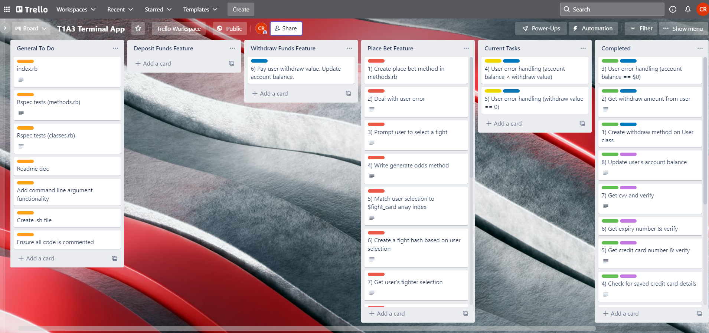

# Smesh Bets (T1A3)
Smesh Bets is a Mixed Martial Arts betting platform built in the Ruby terminal, which allows users to view and bet on upcoming contests. 


## 1) Application Features 

### Feature 1 (Deposit Funds)
This feature allows user to deposit funds they can use to place bets. This feature is built as a method on the User class. It prompts user to provide a deposit amount using TTY prompt, then it will check if if the @credit_card instance variable on the user class is populated. If it isn't it will first request the 16 digit card number, then the 4 digit expiry, then the 3 digit CVV. It will run a card verification method (check_card) on each provided value to ensure the format is correct. Then it will push the credit card details to @credit_card, and update the user's account balance with the requested deposit amount. This process features local variables, instance variables, conditional control structures, and error handling is done using TTY prompt native functionality, as well as a checking method we define on the user class. 

### Feature 2 (Place Bet) 
This feature allows the user to bet their money (tracked in their @account_balance instance variable) on upcoming fights at specified odds. It's defined in the methods.rb file. First it prompts user to select which fight they would like to be on, then which fighter they would like to bet on (displayed alongside associated odds), then how much they would like to wager, then it determines the winner and updates account balance and bet sheet properties accordingly. It uses error handling to check whether @account_balance is lower than minimum bet, or if wager amount is outside of accepted range, or if all fights have already elapsed, or if wager is greater than @account_balance. It uses local variables, instance variables, while loops, conditional statements, and error handling syntax to achieve this functionality. 

### Feature 3 (Withdraw Funds)
This feature allows users to withdraw funds from their account balance, and send it to the payid associated with their mobile number. It's defined in the cash_out method on the User class. First it prompts user for their withdraw amount, then subtracts the withdraw amount from their @account_balance instance variable. Then it alerts the user that the transaction has been processed and prints their updated account balance. It handles user input errors by checking whether the user's account balance is equal to 0, if the withdraw amount is equal to 0, and if the withdraw amount is greater than their account balance. 


## 2) Implementation Plan 


### 1) Deposit Funds Feature 
**Priority: 1**

Deadline: 13/04/22
1) Create User Class 
2) Create deposit method on User class
3) Get deposit amount from user
4) Write method to check credit card numbers
5) Check for saved credit card details
6) Get credit card number & verify
7) Get expiry number & verify
8) Get cvv and verify
9) Update user's account balance

### 2) Withdraw Funds Feature 
**Priority: 2**

Deadline: 14/04/22
1) Create withdraw method on User class
2) Get withdraw amount from user
3) User error handling (account balance == $0)
4) User error handling (account balance < withdraw value)
5) User error handling (withdraw value == 0)
6) Pay user withdraw value. Update account balance.


### 3) Place Bet Feature 
**Priority: 3** 

Deadline: 18/04/22
1) Create Fighter class. 
2) Create place bet method in methods.rb
3) Deal with user error
4) Prompt user to select a fight
5) Write generate odds method
6) Match user selection to $fight_card array index
7) Create a fight hash based on user selection
8) Get user's fighter selection
9) Get wager amount
10) Deal with wager amount user error
11) Create betslip & update instance variables
12) Create fighting method  
13) Condition that actions a betting win
14) Delete completed fight from $fight_card

### 4) General To-Do 
Deadline: 23/04/22
1) index.rb (create new user, fighters, and load main menu)  
1) Rspec tests (methods.rb)
2) Rspec tests (classes.rb)
3) Command Line functionality (name & email to pass to new user class in index.rb)
4) Create .sh file. 


### Trello Board
[Trello Board Link](https://trello.com/invite/b/S5pHKzmG/da78099811e659b29ca2be046afc3712/t1a3-terminal-app) 




## 3) Help Documentation

**Ruby Version:** Smesh Bets is written in Ruby 2.7.5

**Repository:** https://github.com/connorca22/smeshbets 

### Steps to install application
1. If ruby is not installed on your machine - you will need to install it to run the application. [You can find instructions here](https://www.ruby-lang.org/en/documentation/installation/) 
2. [Clone the Smesh Bets project](https://github.com/connorca22/smeshbets) using the command below.
```
$ git clone https://github.com/connorca22/smeshbets.git
```
3. In the terminal, change your directory to the root folder of the Smesh Bets project that you have cloned. 
4. Run the terminal command below in order to make the shell script executable. 
```
chmod +x run.sh 
```
5. Run Smesh Bets app by running the terminal command below. This shell script will install the Ruby gem "Bundler" and all required dependencies, then run the program. 
```
$ ./run.sh
```
6. If you want to pass in your first name, last name, and phone number as strings like below. Note that you can only use letters, hyphens and apostrophes in the name strings, and you can only use a 10 digit number beginning with "04" or "05" in the phone number string.  
```
./run.sh "Connor" "Roberts" "0407263354" 
```

### Dependencies required to operate
Below Ruby gems are required for correct execution of the program. When the shell script is run it will install bundler, and will then install all dependencies listed below. 
- tty-prompt
- faker
- tty-font
- colorize
- rspec 